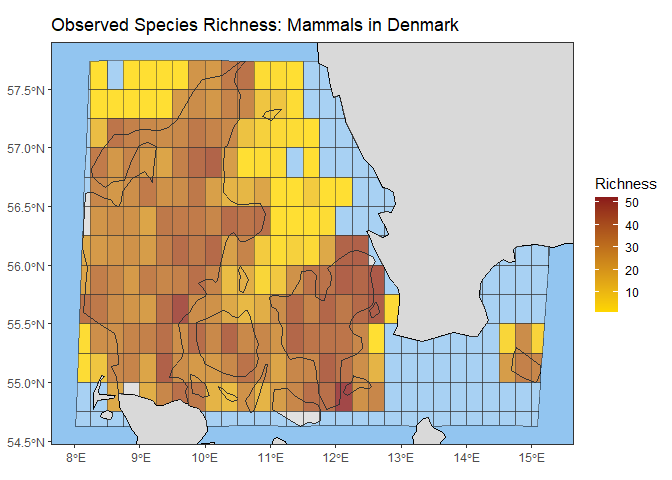

<!-- README.md is generated from README.Rmd. Please edit that file -->

# b3gbi: B-Cubed General Biodiversity Indicators

Analyze biodiversity trends and spatial patterns from GBIF data cubes,
using flexible indicators like richness, evenness, and more.

<!-- badges: start -->

[](https://github.com/your_github_username/b3gbi)

<!-- badges: end -->

## Motivation

Biodiversity researchers need robust and standardized tools to analyze
the vast amounts of data available on platforms like GBIF. The b3gbi
package leverages the power of data cubes to streamline biodiversity
assessments. It helps researchers gain insights into:

- **Changes Over Time:** How biodiversity metrics shift throughout the
  years.
- **Spatial Variations:** Differences in biodiversity across regions,
  identifying hotspots or areas of concern.
- **The Impact of Factors:** How different environmental variables or
  human activities might affect biodiversity patterns.

## Key Features

b3gbi empowers biodiversity analysis with:

- **Standardized Workflows:** Simplify the process of calculating common
  biodiversity indicators from GBIF data cubes.
- **Flexibility:** Calculate richness, evenness, rarity, taxonomic
  distinctness, Shannon-Hill diversity, Simpson-Hill diversity, and
  more.
- **Analysis Options:** Explore temporal trends or create spatial maps.
- **Visualization Tools:** Generate publication-ready plots of your
  biodiversity metrics.

## Installation

You can install the development version of b3gbi from
[GitHub](https://github.com/) with:

``` r
# install.packages("devtools")
# devtools::install_github("shawndove/b3gbi")
```

## Example

This is a basic example which shows you how to calculate and plot a map
of species richness for a data cube containing GBIF occurrence data on
amphibians in Europe:

``` r
# Load necessary libraries
library(b3gbi)
#> Registered S3 method overwritten by 'b3gbi':
#>   method       from 
#>   plot.density stats
library(data.table)
library(ggplot2)

# Load GBIF data cube
cube_name <- "inst/extdata/europe_amphibians_cube.csv"

# Load taxonomic info for cube
tax_info <- "inst/extdata/europe_amphibians_info.csv"

# Prepare cube
amphib_data <- process_cube(cube_name, tax_info)

# Calculate diversity metric
map_obs_rich_amphib <- calculate_indicator(amphib_data, type = "obs_rich")
#> The legacy packages maptools, rgdal, and rgeos, underpinning the sp package,
#> which was just loaded, will retire in October 2023.
#> Please refer to R-spatial evolution reports for details, especially
#> https://r-spatial.org/r/2023/05/15/evolution4.html.
#> It may be desirable to make the sf package available;
#> package maintainers should consider adding sf to Suggests:.
#> The sp package is now running under evolution status 2
#>      (status 2 uses the sf package in place of rgdal)
#> Warning: The `returnclass` argument of `ne_download()` sp as of rnaturalearth 1.0.0.
#> ℹ Please use `sf` objects with {rnaturalearth}, support for Spatial objects
#>   (sp) will be removed in a future release of the package.
#> ℹ The deprecated feature was likely used in the b3gbi package.
#>   Please report the issue to the authors.
#> This warning is displayed once every 8 hours.
#> Call `lifecycle::last_lifecycle_warnings()` to see where this warning was
#> generated.

# Plot diversity metric
plot(map_obs_rich_amphib, title = "Observed Species Richness: Amphibians in Europe") 
```



You’ll still need to render `README.Rmd` regularly, to keep `README.md`
up-to-date. `devtools::build_readme()` is handy for this.

You can also embed plots, for example:


In that case, don’t forget to commit and push the resulting figure
files, so they display on GitHub and CRAN.
