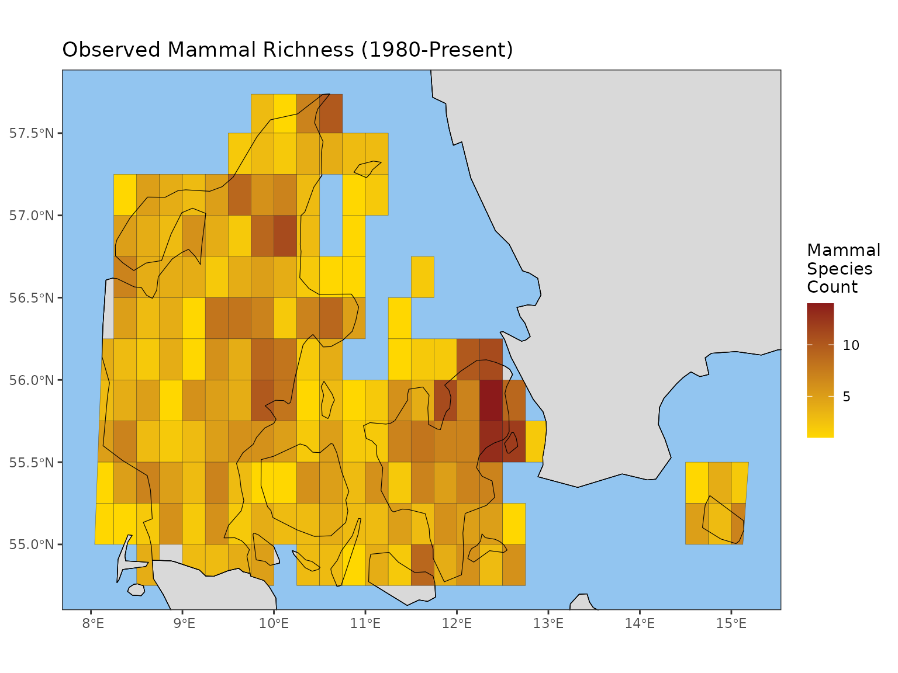
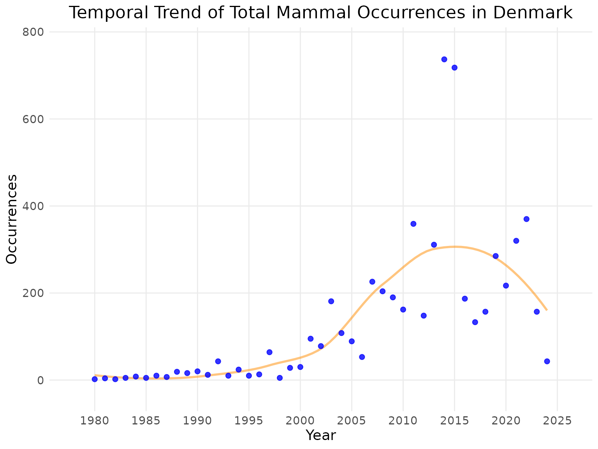

# A Gentle Introduction to b3gbi: Data Cubes to Biodiversity Indicators

## Introduction

The goal of the **b3gbi** package (B3 General Biodiversity Indicators)
is to provide standardized, automated, and reproducible workflows for
calculating essential spatial and temporal biodiversity indicators.
Developed as part of the EU-funded B3 (Biodiversity Building Blocks for
Policy) project, b3gbi takes pre-processed GBIF occurrence cubes as
input and quickly transforms them into actionable metrics, including
richness, evenness, rarity, taxonomic distinctness, Shannon-Hill
diversity, Simpson-Hill diversity, and completeness, complete with
integrated uncertainty estimation using robust bootstrapping methods.

This tutorial will guide you through the three core steps of the b3gbi
workflow:

1.  **Data Ingestion**: Preparing your GBIF data cube with
    [`process_cube()`](https://b-cubed-eu.github.io/b3gbi/reference/process_cube.md).
2.  **Indicator Calculation**: Using indicator-specific wrapper
    functions.
3.  **Visualization**: Plotting the results as maps or time series using
    the generic [`plot()`](https://rdrr.io/r/graphics/plot.default.html)
    function.

The package is publicly available at
<https://www.github.com/b-cubed-eu/b3gbi>.

## Package Installation

The package is available on the dedicated B-Cubed R-universe repository.

``` r

# Install the package from the dedicated R-universe
install.packages("b3gbi", repos = "https://b-cubed-eu.r-universe.dev")

# Load the package
library(b3gbi)
```

## Step 1: Data Ingestion with `process_cube()`

The first step is importing your GBIF occurrence cube (a .csv file) and
converting it into a structured `processed_cube` object. This function
automatically validates the input and attempts to autodetect column
names and grid types.

### Key `process_cube()` Arguments

| Argument | Description | Default/Details |
|----|----|----|
| `data` | Path to the .csv file containing the GBIF cube. Required. |  |
| `grid_type` | The grid system used (e.g., ‘eea’, ‘mgrs’, ‘eqdgc’, ‘isea3h’, ‘custom’). | Autodetected if possible. |
| `first_year` | Filters the cube to start at this year. | First year in the data. |
| `last_year` | Filters the cube to end at this year. | Last year in the data. |

**Note on Column Names**: The function automatically attempts to detect
required columns (like cell code, year, species key). You only need to
manually specify arguments like `cols_year` or `cols_cellCode` if your
column names deviate from expected standards.

### Example: Import Data and Filter by Time

Here we import an example cube of mammals in Denmark, filtering the data
to start from 1980.

``` r

# Function 1: process_cube()
denmark_cube <- process_cube(
  system.file("extdata",
    "denmark_mammals_cube_eqdgc.csv",
    package = "b3gbi"
  ),
  first_year = 1980
) # Filter the cube to start at 1980

# Printing the object shows key metadata
denmark_cube
#> 
#> Processed data cube for calculating biodiversity indicators
#> 
#> Date Range: 1980 - 2024 
#> Single-resolution cube with cell size 0.25degrees 
#> Number of cells: 186 
#> Grid reference system: eqdgc 
#> Coordinate range:
#>  xmin  xmax  ymin  ymax 
#>  3.75 15.25 54.50 58.25 
#> 
#> Total number of observations: 6064 
#> Number of species represented: 53 
#> Number of families represented: 19 
#> 
#> Kingdoms represented: Animalia 
#> 
#> First 10 rows of data (use n = to show more):
#> 
#> # A tibble: 969 × 15
#>     year cellCode  kingdomKey kingdom  familyKey family  taxonKey scientificName
#>    <dbl> <chr>     <chr>      <chr>    <chr>     <chr>   <chr>    <chr>         
#>  1  1980 E010N55AA 1          Animalia 5307      Mustel… 5219019  Mustela ermin…
#>  2  1980 E012N55AD 1          Animalia 5534      Sorici… 8316400  Sorex araneus 
#>  3  1981 E008N55CB 1          Animalia 5310      Phocid… 2434806  Halichoerus g…
#>  4  1981 E010N57BA 1          Animalia 3240723   Cricet… 4265185  Arvicola amph…
#>  5  1981 E011N57CC 1          Animalia 5310      Phocid… 2434806  Halichoerus g…
#>  6  1982 E010N56AD 1          Animalia 5310      Phocid… 2434806  Halichoerus g…
#>  7  1982 E011N56DC 1          Animalia 5310      Phocid… 2434793  Phoca vitulina
#>  8  1983 E009N55CD 1          Animalia 9379      Lepori… 7952072  Lepus europae…
#>  9  1983 E011N55AB 1          Animalia 5310      Phocid… 2434793  Phoca vitulina
#> 10  1983 E015N55CA 1          Animalia 5310      Phocid… 2434806  Halichoerus g…
#> # ℹ 959 more rows
#> # ℹ 7 more variables: obs <dbl>, minCoordinateUncertaintyInMeters <dbl>,
#> #   minTemporalUncertainty <dbl>, familyCount <dbl>, xcoord <dbl>,
#> #   ycoord <dbl>, resolution <chr>
```

The data itself is stored in a tibble within the object’s `data` slot,
and the rest is metadata.

``` r

str(denmark_cube)
#> List of 11
#>  $ first_year  : num 1980
#>  $ last_year   : num 2024
#>  $ coord_range :List of 4
#>   ..$ xmin: num 3.75
#>   ..$ xmax: num 15.2
#>   ..$ ymin: num 54.5
#>   ..$ ymax: num 58.2
#>  $ num_cells   : int 186
#>  $ num_species : int 53
#>  $ num_obs     : num 6064
#>  $ kingdoms    : chr "Animalia"
#>  $ num_families: int 19
#>  $ grid_type   : chr "eqdgc"
#>  $ resolutions : chr "0.25degrees"
#>  $ data        : tibble [969 × 15] (S3: tbl_df/tbl/data.frame)
#>   ..$ year                            : num [1:969] 1980 1980 1981 1981 1981 ...
#>   ..$ cellCode                        : chr [1:969] "E010N55AA" "E012N55AD" "E008N55CB" "E010N57BA" ...
#>   ..$ kingdomKey                      : chr [1:969] "1" "1" "1" "1" ...
#>   ..$ kingdom                         : chr [1:969] "Animalia" "Animalia" "Animalia" "Animalia" ...
#>   ..$ familyKey                       : chr [1:969] "5307" "5534" "5310" "3240723" ...
#>   ..$ family                          : chr [1:969] "Mustelidae" "Soricidae" "Phocidae" "Cricetidae" ...
#>   ..$ taxonKey                        : chr [1:969] "5219019" "8316400" "2434806" "4265185" ...
#>   ..$ scientificName                  : chr [1:969] "Mustela erminea" "Sorex araneus" "Halichoerus grypus" "Arvicola amphibius" ...
#>   ..$ obs                             : num [1:969] 1 1 3 1 1 1 1 1 2 2 ...
#>   ..$ minCoordinateUncertaintyInMeters: num [1:969] 930 390 3 870 3 3 3 780 3 3 ...
#>   ..$ minTemporalUncertainty          : num [1:969] 86400 86400 86400 86400 86400 86400 86400 86400 86400 86400 ...
#>   ..$ familyCount                     : num [1:969] 23427 1360 39284 1954 39284 ...
#>   ..$ xcoord                          : num [1:969] 10.12 12.38 8.38 10.62 11.12 ...
#>   ..$ ycoord                          : num [1:969] 55.9 55.6 55.4 57.9 57.1 ...
#>   ..$ resolution                      : chr [1:969] "0.25degrees" "0.25degrees" "0.25degrees" "0.25degrees" ...
#>  - attr(*, "class")= chr "processed_cube"
```

## Step 2: Indicator Calculation

The package provides numerous wrappers to calculate indicators as either
**maps** (spatial distribution) or **time series** (temporal trends).

### Available Indicators

Use `available_indicators` to see the full list of indicators and their
associated wrapper functions (e.g., `obs_richness_map`, `total_occ_ts`).

``` r

available_indicators
#> 
#> 
#> Available Indicators
#> 
#> 
#> 1. Observed Species Richness
#>     Class: obs_richness
#>     Calculate map: yes, e.g. obs_richness_map(my_data_cube)
#>     Calculate time series: yes, e.g. obs_richness_ts(my_data_cube)
#>     Additional map function arguments: NA
#>     Additional time series function arguments: NA
#> 
#> 2. Total Occurrences
#>     Class: total_occ
#>     Calculate map: yes, e.g. total_occ_map(my_data_cube)
#>     Calculate time series: yes, e.g. total_occ_ts(my_data_cube)
#>     Additional map function arguments: NA
#>     Additional time series function arguments: NA
#> 
#> 3. Pielou's Evenness
#>     Class: pielou_evenness
#>     Calculate map: yes, e.g. pielou_evenness_map(my_data_cube)
#>     Calculate time series: yes, e.g. pielou_evenness_ts(my_data_cube)
#>     Additional map function arguments: NA
#>     Additional time series function arguments: NA
#> 
#> 4. Williams' Evenness
#>     Class: williams_evenness
#>     Calculate map: yes, e.g. williams_evenness_map(my_data_cube)
#>     Calculate time series: yes, e.g. williams_evenness_ts(my_data_cube)
#>     Additional map function arguments: NA
#>     Additional time series function arguments: NA
#> 
#> 5. Cumulative Species Richness
#>     Class: cum_richness
#>     Calculate map: no
#>     Calculate time series: yes, e.g. cum_richness_ts(my_data_cube)
#>     Additional map function arguments: NA
#>     Additional time series function arguments: NA
#> 
#> 6. Density of Occurrences
#>     Class: occ_density
#>     Calculate map: yes, e.g. occ_density_map(my_data_cube)
#>     Calculate time series: yes, e.g. occ_density_ts(my_data_cube)
#>     Additional map function arguments: NA
#>     Additional time series function arguments: NA
#> 
#> 7. Abundance-Based Rarity
#>     Class: ab_rarity
#>     Calculate map: yes, e.g. ab_rarity_map(my_data_cube)
#>     Calculate time series: yes, e.g. ab_rarity_ts(my_data_cube)
#>     Additional map function arguments: NA
#>     Additional time series function arguments: NA
#> 
#> 8. Area-Based Rarity
#>     Class: area_rarity
#>     Calculate map: yes, e.g. area_rarity_map(my_data_cube)
#>     Calculate time series: yes, e.g. area_rarity_ts(my_data_cube)
#>     Additional map function arguments: NA
#>     Additional time series function arguments: NA
#> 
#> 9. Mean Year of Occurrence
#>     Class: newness
#>     Calculate map: yes, e.g. newness_map(my_data_cube)
#>     Calculate time series: yes, e.g. newness_ts(my_data_cube)
#>     Additional map function arguments: NA
#>     Additional time series function arguments: NA
#> 
#> 10. Taxonomic Distinctness
#>     Class: tax_distinct
#>     Calculate map: yes, e.g. tax_distinct_map(my_data_cube)
#>     Calculate time series: yes, e.g. tax_distinct_ts(my_data_cube)
#>     Additional map function arguments: rows
#>     Additional time series function arguments: rows
#> 
#> 11. Species Richness (Estimated by Coverage-Based Rarefaction)
#>     Class: hill0
#>     Calculate map: yes, e.g. hill0_map(my_data_cube)
#>     Calculate time series: yes, e.g. hill0_ts(my_data_cube)
#>     Additional map function arguments: cutoff_length, coverage, conf_level, data_type, assume_freq
#>     Additional time series function arguments: cutoff_length, coverage, conf_level, data_type, assume_freq
#> 
#> 12. Hill-Shannon Diversity (Estimated by Coverage-Based Rarefaction)
#>     Class: hill1
#>     Calculate map: yes, e.g. hill1_map(my_data_cube)
#>     Calculate time series: yes, e.g. hill1_ts(my_data_cube)
#>     Additional map function arguments: cutoff_length, coverage, conf_level, data_type, assume_freq
#>     Additional time series function arguments: cutoff_length, coverage, conf_level, data_type, assume_freq
#> 
#> 13. Hill-Simpson Diversity (Estimated by Coverage-Based Rarefaction)
#>     Class: hill2
#>     Calculate map: yes, e.g. hill2_map(my_data_cube)
#>     Calculate time series: yes, e.g. hill2_ts(my_data_cube)
#>     Additional map function arguments: cutoff_length, coverage, conf_level, data_type, assume_freq
#>     Additional time series function arguments: cutoff_length, coverage, conf_level, data_type, assume_freq
#> 
#> 14. Species Occurrences
#>     Class: spec_occ
#>     Calculate map: yes, e.g. spec_occ_map(my_data_cube)
#>     Calculate time series: yes, e.g. spec_occ_ts(my_data_cube)
#>     Additional map function arguments: NA
#>     Additional time series function arguments: NA
#> 
#> 15. Species Range
#>     Class: spec_range
#>     Calculate map: yes, e.g. spec_range_map(my_data_cube)
#>     Calculate time series: yes, e.g. spec_range_ts(my_data_cube)
#>     Additional map function arguments: NA
#>     Additional time series function arguments: NA
#> 
#> 16. Occupancy Turnover
#>     Class: occ_turnover
#>     Calculate map: no
#>     Calculate time series: yes, e.g. occ_turnover_ts(my_data_cube)
#>     Additional map function arguments: NA
#>     Additional time series function arguments: NA
#> 
#> 17. Species Richness Density
#>     Class: spec_richness_density
#>     Calculate map: yes, e.g. spec_richness_density_map(my_data_cube)
#>     Calculate time series: yes, e.g. spec_richness_density_ts(my_data_cube)
#>     Additional map function arguments: NA
#>     Additional time series function arguments: NA
#> 
#> 18. Completeness (Sample Coverage)
#>     Class: completeness
#>     Calculate map: yes, e.g. completeness_map(my_data_cube)
#>     Calculate time series: yes, e.g. completeness_ts(my_data_cube)
#>     Additional map function arguments: cutoff_length, data_type, assume_freq
#>     Additional time series function arguments: cutoff_length, data_type, assume_freq, gridded_average
#> 
#> 19. Species Relative Occupancy
#>     Class: relative_occupancy
#>     Calculate map: yes, e.g. relative_occupancy_map(my_data_cube)
#>     Calculate time series: yes, e.g. relative_occupancy_ts(my_data_cube)
#>     Additional map function arguments: NA
#>     Additional time series function arguments: NA
```

### Core Arguments for Wrapper Functions

All indicator wrapper functions (e.g., `obs_richness_map`,
`occ_turnover_ts`) share the following key arguments:

| Argument | Description | Details |
|----|----|----|
| `data` | The `processed_cube` object. Required. |  |
| `level` | The geographical scale (‘country’, ‘continent’, ‘world’). | Automatically retrieves boundaries. |
| `region` | The specific region name (e.g., ‘Germany’, ‘Europe’). | Required if level is set. |

### Example: Observed Species Richness Map

Let’s calculate the observed richness spatially, covering the period
from 1980 to the end of the cube’s data.

``` r

# Calculate a gridded map of observed species richness for Denmark
# Note that confidence intervals are not calculated for map indicators
Denmark_observed_richness_map <- obs_richness_map(denmark_cube, 
                                                   level = "country", 
                                                   region = "Denmark") 
```

The result is an `indicator_map` object (the data within it is also an
`sf` object, containing geographical information).

``` r

class(Denmark_observed_richness_map)
#> [1] "indicator_map" "obs_richness"
class(Denmark_observed_richness_map$data)
#> [1] "indicator_data" "sf"             "tbl_df"         "tbl"           
#> [5] "data.frame"
```

### Example: Total Occurrences Time Series

Now, let’s calculate the same indicator temporally for a trend analysis.

``` r

# Calculate a time series of total occurrences for Denmark
# By default, confidence intervals are NOT calculated during this step
Denmark_total_occ_ts <- total_occ_ts(denmark_cube, 
                                     level = "country", 
                                     region = "Denmark")
```

The result is an `indicator_ts` object.

``` r

class(Denmark_total_occ_ts)
#> [1] "indicator_ts" "total_occ"
```

Now let’s add confidence intervals using the
[`add_ci()`](https://b-cubed-eu.github.io/b3gbi/reference/add_ci.md)
function. To speed things up we will reduce the number of bootstrap
samples from the default of 1000 to 100. By default, the package uses
**percentile** intervals (`"perc"`), which are robust for biodiversity
indicators.

``` r

# Add confidence intervals to the time series
Denmark_total_occ_ts_with_ci <- add_ci(Denmark_total_occ_ts, 
                                       num_bootstrap = 100)
#> [1] "Performing group-specific bootstrap with `boot::boot()`."
```

For more in-depth information on how uncertainty is handled, the
different types of confidence intervals available, and advanced
configuration options, please see the [Uncertainty in Biodiversity
Indicators](https://b-cubed-eu.github.io/b3gbi/articles/uncertainty.md)
vignette.

## Step 3: Visualization with `plot()`

The generic [`plot()`](https://rdrr.io/r/graphics/plot.default.html)
function automatically calls the appropriate helper function
([`plot_map()`](https://b-cubed-eu.github.io/b3gbi/reference/plot_map.md)
or
[`plot_ts()`](https://b-cubed-eu.github.io/b3gbi/reference/plot_ts.md))
and applies smart defaults for titles, colors, and layout.

### Plotting the Map

| Argument | Description | Common Use |
|----|----|----|
| `title` | Sets the plot title. | e.g., “Observed Richness in Denmark” |
| `legend_title` | Sets the legend title. | e.g., “Number of Species” |
| `crop_to_grid` | If TRUE, the map edges are determined by the grid extent. |  |
| `crop_by_region` | If TRUE, map edges are determined by the map region selected during indicator calculation, rather than the data. |  |

``` r

# Plotting the map object
plot(Denmark_observed_richness_map,
  legend_title = "Mammal Species Count",
  title = "Observed Mammal Richness (1980-Present)"
)
```



### Plotting the Time Series

If your `indicator_ts` object contains confidence intervals, the
[`plot()`](https://rdrr.io/r/graphics/plot.default.html) function will
automatically display them as ribbons or error bars.

``` r

# Plotting the time series object
plot(Denmark_total_occ_ts,
  title = "Temporal Trend of Total Mammal Occurrences in Denmark",
  linecolour = "blue",
  ribboncolour = "skyblue",
  trendlinecolour = "darkorange",
  envelopecolour = "orange",
  smoothed_trend = TRUE
)
```


