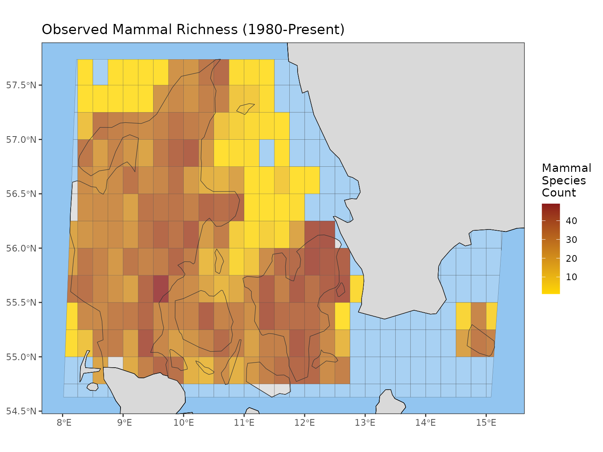
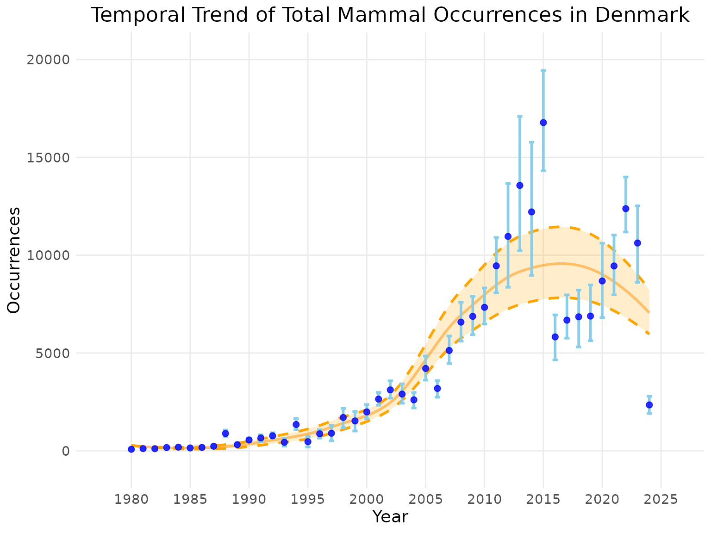

# A Gentle Introduction to b3gbi: Data Cubes to Biodiversity Indicators

## Introduction 🌍

The goal of the **b3gbi** package (B3 General Biodiversity Indicators)
is to provide standardized, automated, and reproducible workflows for
calculating essential spatial and temporal biodiversity indicators.
Developed as part of the EU-funded B3 (Biodiversity Building Blocks for
Policy) project, b3gbi takes pre-processed GBIF occurrence cubes as
input and quickly transforms them into actionable metrics, complete with
integrated uncertainty estimation using robust bootstrapping methods.

This tutorial will guide you through the three core steps of the b3gbi
workflow:

1.  **Data Ingestion**: Preparing your GBIF data cube with
    [`process_cube()`](https://b-cubed-eu.github.io/b3gbi/reference/process_cube.md).
2.  **Indicator Calculation**: Using indicator-specific wrapper
    functions.
3.  **Visualization**: Plotting the results as maps or time series using
    the generic [`plot()`](https://rdrr.io/r/graphics/plot.default.html)
    function.

The package is publicly available at
<https://www.github.com/b-cubed-eu/b3gbi>.

## Package Installation

The package is available on the dedicated B-Cubed R-universe repository.

``` r
# Install the package from the dedicated R-universe
install.packages("b3gbi", repos = "https://b-cubed-eu.r-universe.dev")

# Load the package
library(b3gbi)
```

## Step 1: Data Ingestion with `process_cube()`

The first step is importing your GBIF occurrence cube (a .csv file) and
converting it into a structured `processed_cube` object. This function
automatically validates the input and attempts to autodetect column
names and grid types.

### Key `process_cube()` Arguments

| Argument     | Description                                                    | Default/Details           |
|--------------|----------------------------------------------------------------|---------------------------|
| `data`       | Path to the .csv file containing the GBIF cube. Required.      |                           |
| `grid_type`  | The grid system used (e.g., ‘eea’, ‘mgrs’, ‘eqdgc’, ‘custom’). | Autodetected if possible. |
| `first_year` | Filters the cube to start at this year.                        | First year in the data.   |
| `last_year`  | Filters the cube to end at this year.                          | Last year in the data.    |

💡 **Note on Column Names**: The function automatically attempts to
detect required columns (like cell code, year, species key). You only
need to manually specify arguments like `cols_year` or `cols_cellCode`
if your column names deviate from expected standards.

### Example: Import Data and Filter by Time

Here we import an example cube of mammals in Denmark, filtering the data
to start from 1980.

``` r
# Function 1: process_cube()
denmark_cube <- process_cube(system.file("extdata", 
                                         "denmark_mammals_cube_eqdgc.csv", 
                                         package = "b3gbi"),
                             first_year = 1980) # Filter the cube to start at 1980

# Printing the object shows key metadata
denmark_cube
#> 
#> Processed data cube for calculating biodiversity indicators
#> 
#> Date Range: 1980 - 2024 
#> Single-resolution cube with cell size 0.25degrees 
#> Number of cells: 323 
#> Grid reference system: eqdgc 
#> Coordinate range:
#>  xmin  xmax  ymin  ymax 
#>  3.25 15.75 54.25 58.25 
#> 
#> Total number of observations: 204664 
#> Number of species represented: 100 
#> Number of families represented: 31 
#> 
#> Kingdoms represented: Animalia 
#> 
#> First 10 rows of data (use n = to show more):
#> 
#> # A tibble: 30,985 × 15
#>     year cellCode  kingdomKey kingdom  familyKey family  taxonKey scientificName
#>    <dbl> <chr>          <dbl> <chr>        <dbl> <chr>      <dbl> <chr>         
#>  1  1980 E008N55CB          1 Animalia      5310 Phocid…  2434793 Phoca vitulina
#>  2  1980 E008N56BB          1 Animalia      5307 Mustel…  5218987 Mustela nival…
#>  3  1980 E008N57DC          1 Animalia      9361 Phocoe…  2440669 Phocoena phoc…
#>  4  1980 E009N55BB          1 Animalia      5722 Erinac…  5219616 Erinaceus eur…
#>  5  1980 E009N56BB          1 Animalia      9368 Vesper…  5218507 Plecotus auri…
#>  6  1980 E009N57DD          1 Animalia      9361 Phocoe…  2440669 Phocoena phoc…
#>  7  1980 E010N55AA          1 Animalia      5310 Phocid…  2434793 Phoca vitulina
#>  8  1980 E010N55AA          1 Animalia      5307 Mustel…  5219019 Mustela ermin…
#>  9  1980 E010N55BB          1 Animalia      5310 Phocid…  2434793 Phoca vitulina
#> 10  1980 E010N56CB          1 Animalia      5307 Mustel…  5218887 Martes foina  
#> # ℹ 30,975 more rows
#> # ℹ 7 more variables: obs <dbl>, minCoordinateUncertaintyInMeters <dbl>,
#> #   minTemporalUncertainty <dbl>, familyCount <dbl>, xcoord <dbl>,
#> #   ycoord <dbl>, resolution <chr>
```

The data itself is stored in a tibble within the object’s `data` slot,
and the rest is metadata.

``` r
str(denmark_cube)
#> List of 11
#>  $ first_year  : num 1980
#>  $ last_year   : num 2024
#>  $ coord_range :List of 4
#>   ..$ xmin: num 3.25
#>   ..$ xmax: num 15.8
#>   ..$ ymin: num 54.2
#>   ..$ ymax: num 58.2
#>  $ num_cells   : int 323
#>  $ num_species : int 100
#>  $ num_obs     : num 204664
#>  $ kingdoms    : chr "Animalia"
#>  $ num_families: int 31
#>  $ grid_type   : chr "eqdgc"
#>  $ resolutions : chr "0.25degrees"
#>  $ data        : tibble [30,985 × 15] (S3: tbl_df/tbl/data.frame)
#>   ..$ year                            : num [1:30985] 1980 1980 1980 1980 1980 1980 1980 1980 1980 1980 ...
#>   ..$ cellCode                        : chr [1:30985] "E008N55CB" "E008N56BB" "E008N57DC" "E009N55BB" ...
#>   ..$ kingdomKey                      : num [1:30985] 1 1 1 1 1 1 1 1 1 1 ...
#>   ..$ kingdom                         : chr [1:30985] "Animalia" "Animalia" "Animalia" "Animalia" ...
#>   ..$ familyKey                       : num [1:30985] 5310 5307 9361 5722 9368 ...
#>   ..$ family                          : chr [1:30985] "Phocidae" "Mustelidae" "Phocoenidae" "Erinaceidae" ...
#>   ..$ taxonKey                        : num [1:30985] 2434793 5218987 2440669 5219616 5218507 ...
#>   ..$ scientificName                  : chr [1:30985] "Phoca vitulina" "Mustela nivalis" "Phocoena phocoena" "Erinaceus europaeus" ...
#>   ..$ obs                             : num [1:30985] 1 1 27 1 1 1 1 1 1 1 ...
#>   ..$ minCoordinateUncertaintyInMeters: num [1:30985] 3 1000 1000 50 1000 1000 3 930 3 92 ...
#>   ..$ minTemporalUncertainty          : num [1:30985] 86400 86400 86400 86400 2678400 ...
#>   ..$ familyCount                     : num [1:30985] 39284 23427 19402 3807 16848 ...
#>   ..$ xcoord                          : num [1:30985] 8.38 8.88 8.62 9.88 9.88 ...
#>   ..$ ycoord                          : num [1:30985] 55.4 56.9 57.1 55.9 56.9 ...
#>   ..$ resolution                      : chr [1:30985] "0.25degrees" "0.25degrees" "0.25degrees" "0.25degrees" ...
#>  - attr(*, "class")= chr "processed_cube"
```

## Step 2: Indicator Calculation

The package provides numerous wrappers to calculate indicators as either
**maps** (spatial distribution) or **time series** (temporal trends).

### Available Indicators

Use `available_indicators` to see the full list of indicators and their
associated wrapper functions (e.g., `obs_richness_map`, `total_occ_ts`).

``` r
available_indicators
#> 
#> 
#> Available Indicators
#> 
#> 
#> 1. Observed Species Richness
#>     Class: obs_richness
#>     Calculate map: yes, e.g. obs_richness_map(my_data_cube)
#>     Calculate time series: yes, e.g. obs_richness_ts(my_data_cube)
#>     Additional map function arguments: NA
#>     Additional time series function arguments: NA
#> 
#> 2. Total Occurrences
#>     Class: total_occ
#>     Calculate map: yes, e.g. total_occ_map(my_data_cube)
#>     Calculate time series: yes, e.g. total_occ_ts(my_data_cube)
#>     Additional map function arguments: NA
#>     Additional time series function arguments: NA
#> 
#> 3. Pielou's Evenness
#>     Class: pielou_evenness
#>     Calculate map: yes, e.g. pielou_evenness_map(my_data_cube)
#>     Calculate time series: yes, e.g. pielou_evenness_ts(my_data_cube)
#>     Additional map function arguments: NA
#>     Additional time series function arguments: NA
#> 
#> 4. Williams' Evenness
#>     Class: williams_evenness
#>     Calculate map: yes, e.g. williams_evenness_map(my_data_cube)
#>     Calculate time series: yes, e.g. williams_evenness_ts(my_data_cube)
#>     Additional map function arguments: NA
#>     Additional time series function arguments: NA
#> 
#> 5. Cumulative Species Richness
#>     Class: cum_richness
#>     Calculate map: no
#>     Calculate time series: yes, e.g. cum_richness_ts(my_data_cube)
#>     Additional map function arguments: NA
#>     Additional time series function arguments: NA
#> 
#> 6. Density of Occurrences
#>     Class: occ_density
#>     Calculate map: yes, e.g. occ_density_map(my_data_cube)
#>     Calculate time series: yes, e.g. occ_density_ts(my_data_cube)
#>     Additional map function arguments: NA
#>     Additional time series function arguments: NA
#> 
#> 7. Abundance-Based Rarity
#>     Class: ab_rarity
#>     Calculate map: yes, e.g. ab_rarity_map(my_data_cube)
#>     Calculate time series: yes, e.g. ab_rarity_ts(my_data_cube)
#>     Additional map function arguments: NA
#>     Additional time series function arguments: NA
#> 
#> 8. Area-Based Rarity
#>     Class: area_rarity
#>     Calculate map: yes, e.g. area_rarity_map(my_data_cube)
#>     Calculate time series: yes, e.g. area_rarity_ts(my_data_cube)
#>     Additional map function arguments: NA
#>     Additional time series function arguments: NA
#> 
#> 9. Mean Year of Occurrence
#>     Class: newness
#>     Calculate map: yes, e.g. newness_map(my_data_cube)
#>     Calculate time series: yes, e.g. newness_ts(my_data_cube)
#>     Additional map function arguments: NA
#>     Additional time series function arguments: NA
#> 
#> 10. Taxonomic Distinctness
#>     Class: tax_distinct
#>     Calculate map: yes, e.g. tax_distinct_map(my_data_cube)
#>     Calculate time series: yes, e.g. tax_distinct_ts(my_data_cube)
#>     Additional map function arguments: NA
#>     Additional time series function arguments: NA
#> 
#> 11. Species Richness (Estimated by Coverage-Based Rarefaction)
#>     Class: hill0
#>     Calculate map: yes, e.g. hill0_map(my_data_cube)
#>     Calculate time series: yes, e.g. hill0_ts(my_data_cube)
#>     Additional map function arguments: cutoff_length, coverage
#>     Additional time series function arguments: cutoff_length, coverage
#> 
#> 12. Hill-Shannon Diversity (Estimated by Coverage-Based Rarefaction)
#>     Class: hill1
#>     Calculate map: yes, e.g. hill1_map(my_data_cube)
#>     Calculate time series: yes, e.g. hill1_ts(my_data_cube)
#>     Additional map function arguments: cutoff_length, coverage
#>     Additional time series function arguments: cutoff_length, coverage
#> 
#> 13. Hill-Simpson Diversity (Estimated by Coverage-Based Rarefaction)
#>     Class: hill2
#>     Calculate map: yes, e.g. hill2_map(my_data_cube)
#>     Calculate time series: yes, e.g. hill2_ts(my_data_cube)
#>     Additional map function arguments: cutoff_length, coverage
#>     Additional time series function arguments: cutoff_length, coverage
#> 
#> 14. Species Occurrences
#>     Class: spec_occ
#>     Calculate map: yes, e.g. spec_occ_map(my_data_cube)
#>     Calculate time series: yes, e.g. spec_occ_ts(my_data_cube)
#>     Additional map function arguments: none
#>     Additional time series function arguments: none
#> 
#> 15. Species Range
#>     Class: spec_range
#>     Calculate map: yes, e.g. spec_range_map(my_data_cube)
#>     Calculate time series: yes, e.g. spec_range_ts(my_data_cube)
#>     Additional map function arguments: none
#>     Additional time series function arguments: none
#> 
#> 16. Occupancy Turnover
#>     Class: occ_turnover
#>     Calculate map: no
#>     Calculate time series: yes, e.g. occ_turnover_ts(my_data_cube)
#>     Additional map function arguments: none
#>     Additional time series function arguments: none
```

### Core Arguments for Wrapper Functions

All indicator wrapper functions (e.g., `obs_richness_map`,
`occ_turnover_ts`) share the following key arguments:

| Argument        | Description                                                                        | Details                                                                        |
|-----------------|------------------------------------------------------------------------------------|--------------------------------------------------------------------------------|
| `data`          | The `processed_cube` object. Required.                                             |                                                                                |
| `level`         | The geographical scale (‘country’, ‘continent’, ‘world’).                          | Automatically retrieves boundaries.                                            |
| `region`        | The specific region name (e.g., ‘Germany’, ‘Europe’).                              | Required if level is set.                                                      |
| `ci_type`       | Type of bootstrap confidence interval to calculate. Only relevant for time series. | ‘norm’, ‘basic’, ‘perc’, ‘bca’, or ‘none’. Defaults to ‘norm’ for time series. |
| `num_bootstrap` | Number of bootstrap runs for CI calculation. Only relevant for time series.        | Defaults to 100.                                                               |

⚠️ **Important Note on Confidence Intervals (CIs)**:

- The `ci_type` argument is only used for calculating uncertainty in
  general time series indicators (e.g., `obs_richness_ts`) and is
  ignored for map indicators.
- For indicators based on Hill diversity (e.g., `hill_ts()`), the
  `ci_type` is ignored because CIs are calculated internally using the
  iNEXT package. However, the `num_bootstrap` argument is still required
  to define the number of runs for iNEXT’s internal uncertainty
  estimation.

### Example: Observed Species Richness Map

Let’s calculate the observed richness spatially, covering the period
from 1980 to the end of the cube’s data.

``` r
# Calculate a gridded map of observed species richness for Denmark
# Note that ci_type is ignored for map indicators
Denmark_observed_richness_map <- obs_richness_map(denmark_cube, 
                                                   level = "country", 
                                                   region = "Denmark") 
```

The result is an `indicator_map` object (the data within it is also an
`sf` object, containing geographical information).

``` r
class(Denmark_observed_richness_map)
#> [1] "indicator_map" "obs_richness"
class(Denmark_observed_richness_map$data)
#> [1] "indicator_data" "sf"             "data.frame"
```

### Example: Total Occurrences Time Series

Now, let’s calculate the same indicator temporally for a trend analysis.
We will use the default `ci_type = "norm"` and `num_bootstrap = 100`.

``` r
# Calculate a time series of total occurrences for Denmark
Denmark_total_occ_ts <- total_occ_ts(denmark_cube, 
                                                 level = "country", 
                                                 region = "Denmark", 
                                                 ci_type = "norm", # Include confidence intervals
                                                 num_bootstrap = 100) # Using the default number of runs
```

The result is an `indicator_ts` object.

``` r
class(Denmark_total_occ_ts)
#> [1] "indicator_ts" "total_occ"
```

## Step 3: Visualization with `plot()`

The generic [`plot()`](https://rdrr.io/r/graphics/plot.default.html)
function automatically calls the appropriate helper function
([`plot_map()`](https://b-cubed-eu.github.io/b3gbi/reference/plot_map.md)
or
[`plot_ts()`](https://b-cubed-eu.github.io/b3gbi/reference/plot_ts.md))
and applies smart defaults for titles, colors, and layout.

### Plotting the Map

| Argument         | Description                                                                                                      | Common Use                           |
|------------------|------------------------------------------------------------------------------------------------------------------|--------------------------------------|
| `title`          | Sets the plot title.                                                                                             | e.g., “Observed Richness in Denmark” |
| `legend_title`   | Sets the legend title.                                                                                           | e.g., “Number of Species”            |
| `crop_to_grid`   | If TRUE, the map edges are determined by the grid extent.                                                        |                                      |
| `crop_by_region` | If TRUE, map edges are determined by the map region selected during indicator calculation, rather than the data. |                                      |

``` r
# Plotting the map object
plot(Denmark_observed_richness_map, 
     legend_title = "Mammal Species Count",
     title = "Observed Mammal Richness (1980-Present)")
```



### Plotting the Time Series

| Argument              | Description                                            | Common Use         |
|-----------------------|--------------------------------------------------------|--------------------|
| `smoothed_trend`      | If TRUE, displays a smoothed trend line (LOESS).       | Defaults to TRUE.  |
| `linecolour`          | Sets the color of the indicator line/points.           | e.g., “blue”       |
| `ribboncolour`        | Sets the color of the indicator confidence interval.   | e.g., “skyblue”    |
| `trendlinecolour`     | Sets the color of the trend line.                      | e.g., “darkorange” |
| `envelopecolour`      | Sets the color of the trend line confidence intervals. | e.g., “orange”     |
| `x_label` / `y_label` | Custom labels for the axes.                            |                    |

``` r
# Plotting the time series object
plot(Denmark_total_occ_ts, 
     title = "Temporal Trend of Total Mammal Occurrences in Denmark",
     linecolour = "blue",
     ribboncolour = "skyblue",
     trendlinecolour = "darkorange",
     envelopecolour = "orange",
     smoothed_trend = TRUE)
```


