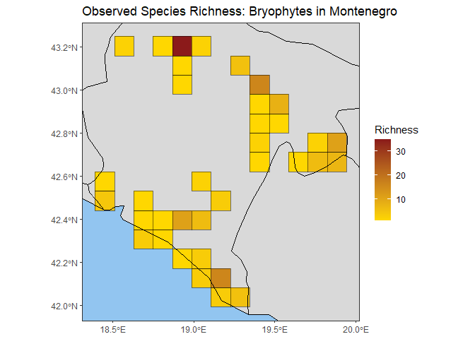

# b3gbi

Analyze biodiversity trends and spatial patterns from GBIF data cubes,
using flexible indicators like richness, evenness, and more.

## Overview

Biodiversity researchers need robust and standardized tools to analyze
the vast amounts of data available on platforms like GBIF. The b3gbi
package leverages the power of data cubes to streamline biodiversity
assessments. It helps researchers gain insights into:

- **Changes Over Time:** How biodiversity metrics shift throughout the
  years.
- **Spatial Variations:** Differences in biodiversity across regions,
  identifying hotspots or areas of concern.
- **The Impact of Factors:** How different environmental variables or
  human activities might affect biodiversity patterns.

## Key Features

b3gbi empowers biodiversity analysis with:

- **Standardized Workflows:** Simplify the process of calculating common
  biodiversity indicators from GBIF data cubes.
- **Flexibility:** Calculate richness, evenness, rarity, taxonomic
  distinctness, Shannon-Hill diversity, Simpson-Hill diversity,
  completeness, and more.
- **Analysis Options:** Explore temporal trends or create spatial maps.
- **Visualization Tools:** Generate publication-ready plots of your
  biodiversity metrics.

## Installation

Install **b3gbi** in R:

``` r

install.packages("b3gbi", repos = c("https://b-cubed-eu.r-universe.dev", "https://cloud.r-project.org"))
```

## Example: Three-Step Workflow

This basic example demonstrates the core workflow: preparing the data
cube, calculating an indicator, and plotting the result as a spatial map
of species richness for bryophytes in Montenegro.

``` r

# Load package
library(b3gbi)

# 1. Load and prepare the GBIF data cube
cube_name <- system.file("extdata", "montenegro_bryophytes_cube_eea.csv", package = "b3gbi")
bryophyte_data <- process_cube(cube_name)

# 2. Calculate a map of observed richness
map_rich_bryo <- obs_richness_map(bryophyte_data, level = "country", region = "Montenegro", ne_scale = "medium", cell_size = 10)

# 3. Plot the indicator map
plot(map_rich_bryo, title = "Observed Species Richness: Bryophytes in Montenegro")
```



For a more in-depth introduction, see the tutorial:
<https://b-cubed-eu.github.io/b3gbi/articles/b3gbi.html>.
